# GitHub Profile Analyzer API

> A RESTful backend service that analyzes GitHub user profiles using the GitHub public API, computes rich developer insights, and persists everything in MySQL.

---

## 🚀 Features

- **Analyze any GitHub user** — Fetches profile data and up to 500 public repositories
- **Computed insights** — Activity score, language distribution, star/fork aggregates, account age, repo composition breakdown
- **Persistent storage** — All data stored across 3 normalized MySQL tables with cascade deletes
- **Re-analyzable** — Run analyze again to refresh data for any user
- **Paginated listing** — Sort by followers, stars, activity score, or analysis date
- **Clean REST API** — Consistent JSON responses with proper status codes
- **Rate-limit friendly** — Supports GitHub Personal Access Token for 5000 req/hr

---

## 🛠 Tech Stack

| Component | Technology |
|---|---|
| Runtime | Node.js 18+ |
| Framework | Express.js 4 |
| Database | MySQL 8 |
| GitHub API | REST API v3 (public) |
| HTTP Client | axios |
| Validation | express-validator |
| Logging | morgan |

---

## 📋 Prerequisites

- [Node.js 18+](https://nodejs.org/)
- [MySQL 8+](https://dev.mysql.com/downloads/)
- npm

---

## ⚙️ Setup Instructions

### 1. Clone the repository

```bash
git clone https://github.com/YOUR_USERNAME/github-profile-analyzer.git
cd github-profile-analyzer
```

### 2. Install dependencies

```bash
npm install
```

### 3. Configure environment variables

```bash
cp .env.example .env
```

Edit `.env` and fill in your values:

```env
PORT=3000
NODE_ENV=development

DB_HOST=localhost
DB_PORT=3306
DB_USER=root
DB_PASSWORD=your_mysql_password
DB_NAME=github_analyzer

# Optional but recommended — increases GitHub rate limit from 60 to 5000 req/hr
# Generate at: https://github.com/settings/tokens (no special scopes needed for public data)
GITHUB_TOKEN=ghp_your_token_here
```

### 4. Initialize the database

This creates the `github_analyzer` database and all tables:

```bash
node src/config/initDb.js
```

Alternatively, you can run the schema manually:

```bash
mysql -u root -p < database/schema.sql
```

### 5. Start the server

```bash
# Development (with auto-restart on file changes)
npm run dev

# Production
npm start
```

The server starts at **http://localhost:3000**

### Development Environment

XAMPP services used for local development.

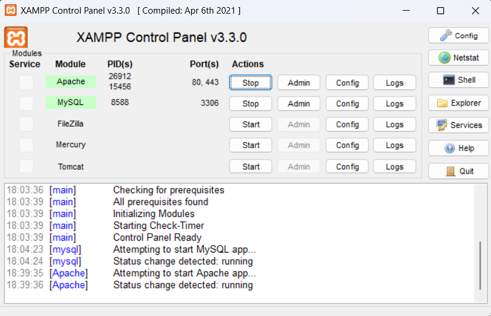

---

## 📡 API Reference

### Base URL: `http://localhost:3000`

---

### `GET /api/health`

Health check endpoint.

**Response:**
```json
{
  "success": true,
  "status": "ok",
  "service": "GitHub Profile Analyzer API",
  "version": "1.0.0",
  "timestamp": "2024-01-15T10:30:00.000Z"
}
```

#### Health Check Output

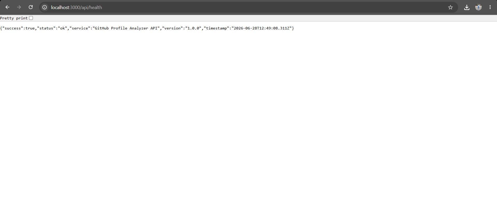

---

### `POST /api/profiles/analyze/:username`

Fetches a GitHub user's public profile and repositories, computes insights, and stores everything in the database. Calling this again for the same user **refreshes** the stored data.

**Example:**
```
POST /api/profiles/analyze/torvalds
```

**Response (200 OK):**
```json
{
  "success": true,
  "message": "Profile for \"torvalds\" analyzed and stored successfully.",
  "data": {
    "profile": {
      "id": 1,
      "username": "torvalds",
      "name": "Linus Torvalds",
      "bio": "...",
      "location": "Portland, OR",
      "public_repos": 8,
      "followers": 243000,
      "following": 0,
      "analyzed_at": "2024-01-15T10:30:00.000Z"
    },
    "insights": {
      "top_language": "C",
      "language_distribution": { "C": 4, "Python": 2 },
      "total_stars": 183000,
      "total_forks": 36000,
      "activity_score": 87.50,
      "account_age_days": 5400,
      "most_starred_repo": "linux",
      "most_starred_repo_url": "https://github.com/torvalds/linux"
    },
    "repositories": [...],
    "meta": { "repos_fetched": 8 }
  }
}
```

**Error Responses:**
- `404` — GitHub user not found
- `429` — GitHub API rate limit exceeded
- `400` — Invalid username format

#### Profile Analysis

The API fetches data from GitHub, computes insights and persists them into MySQL.

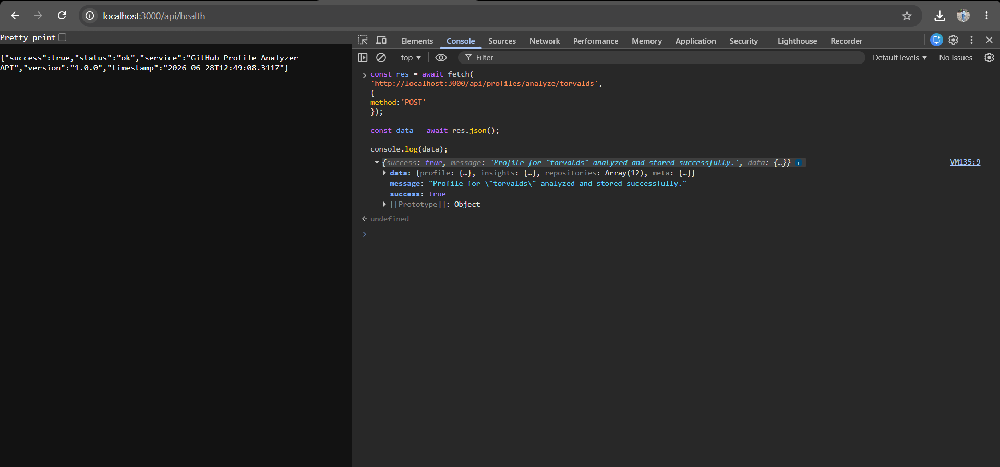

---

### `GET /api/profiles`

Returns a paginated list of all analyzed profiles.

**Query Parameters:**

| Parameter | Default | Options |
|---|---|---|
| `page` | `1` | Any positive integer |
| `page_size` | `10` | `1–50` |
| `sort_by` | `analyzed_at` | `analyzed_at`, `followers`, `public_repos`, `activity_score` |
| `sort_dir` | `desc` | `asc`, `desc` |

**Example:**
```
GET /api/profiles?page=1&page_size=5&sort_by=activity_score&sort_dir=desc
```

**Response (200 OK):**
```json
{
  "success": true,
  "data": [
    {
      "username": "torvalds",
      "name": "Linus Torvalds",
      "followers": 243000,
      "top_language": "C",
      "total_stars": 183000,
      "activity_score": 87.50
    }
  ],
  "pagination": {
    "total": 15,
    "page": 1,
    "page_size": 5,
    "total_pages": 3
  }
}
```

#### Stored Profiles

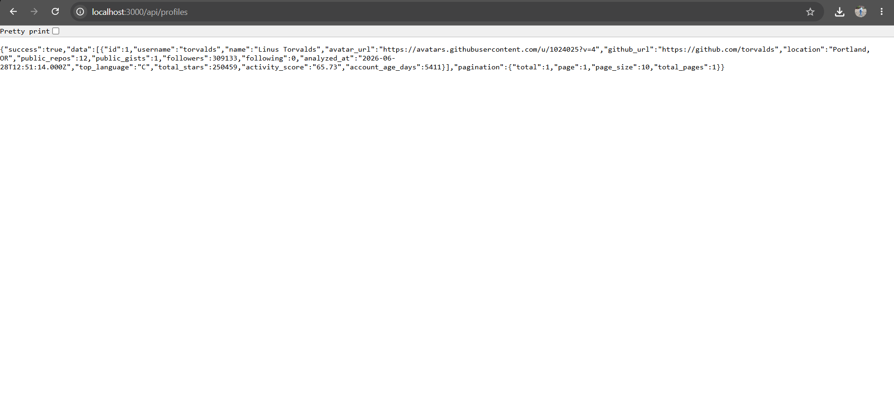

---

### `GET /api/profiles/:username`

Returns the full stored analysis for a specific username (profile + insights + repositories).

**Example:**
```
GET /api/profiles/torvalds
```

**Error Responses:**
- `404` — Profile not yet analyzed (use POST first)

#### Complete Profile Analysis

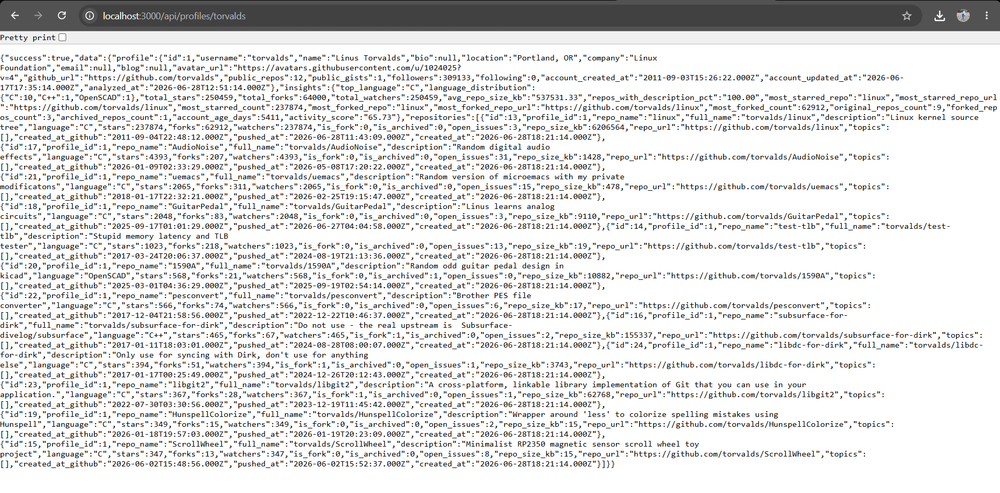

---

### `DELETE /api/profiles/:username`

Permanently removes a stored profile and all associated insights/repository data.

**Example:**
```
DELETE /api/profiles/torvalds
```

**Response (200 OK):**
```json
{
  "success": true,
  "message": "Profile \"torvalds\" and all related data deleted successfully."
}
```

---

## 🗄️ Database Schema

Three main tables + one view:

```
profiles          — GitHub user snapshot
profile_insights  — Computed analytics (1:1 with profiles)
repositories      — Public repos snapshot (1:N with profiles)
v_profile_summary — Convenience view joining all three
```

See [`database/schema.sql`](database/schema.sql) for the full schema.

### Database Overview

Available tables inside the `github_analyzer` database.

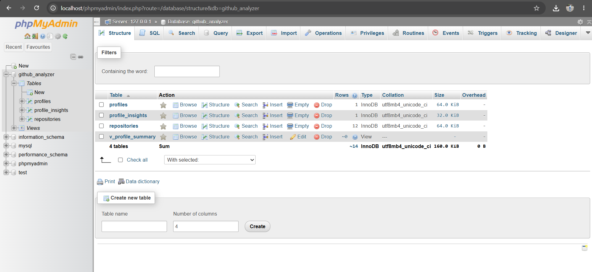

---

### Profiles Table

Stores GitHub profile snapshots.

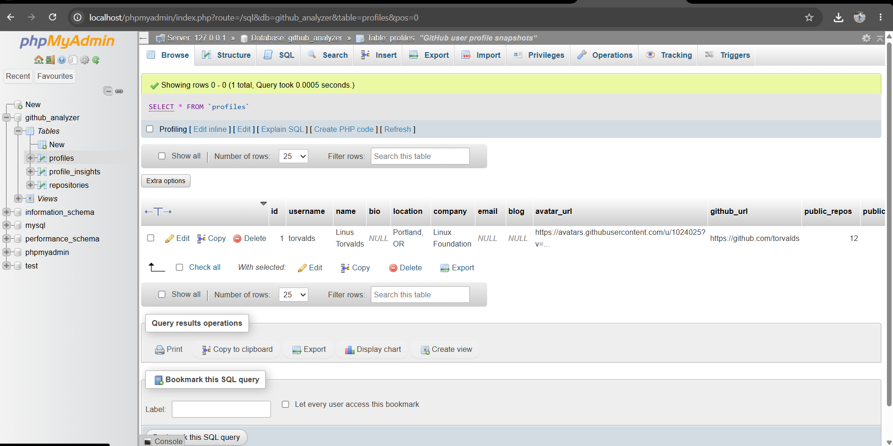

---

### Insights Table

Stores computed analytics.

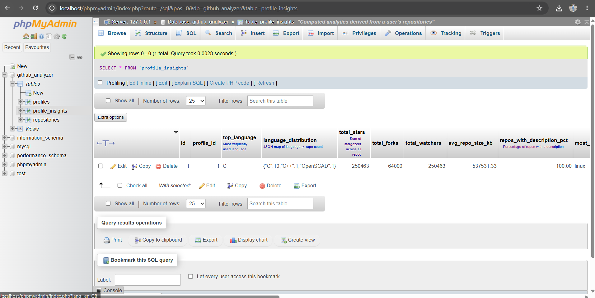

---

### Repository Table

Stores repository snapshots.

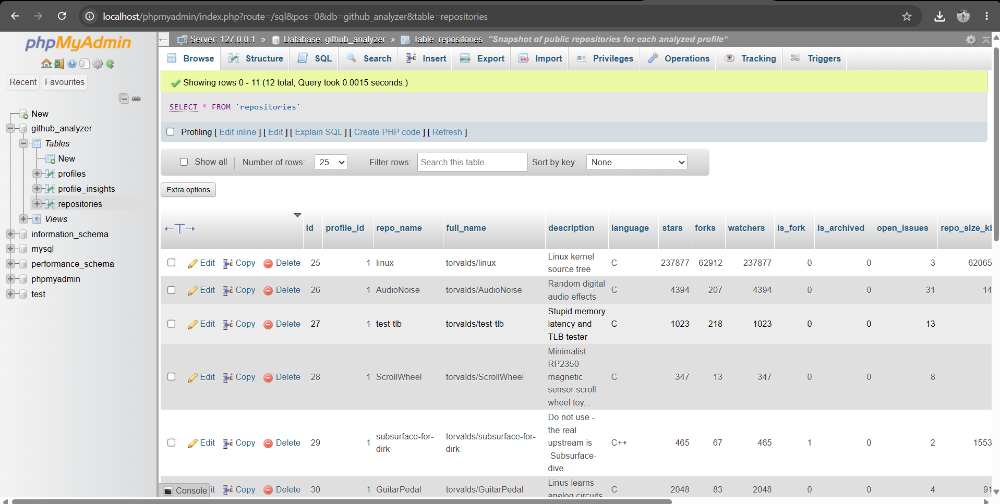

---

### Entity Relationship

```
profiles
  │
  ├──< profile_insights  (1:1, CASCADE DELETE)
  │
  └──< repositories      (1:N, CASCADE DELETE)
```

---

## 📊 Computed Insights Explained

| Insight | Description |
|---|---|
| `activity_score` | 0–100 score: weighted combo of followers (30%), stars (25%), repos (20%), recent pushes (25%) |
| `language_distribution` | JSON map of `language → repo count` across all repos |
| `top_language` | Most frequently used language |
| `total_stars` | Sum of all stargazers across non-fork repos |
| `account_age_days` | Days since GitHub account creation |
| `repos_with_description_pct` | % of repos that have a description |
| `most_starred_repo` | Repository with the highest star count |

---

## 🧪 Testing with Postman

Import the collection from [`postman/GitHub_Profile_Analyzer.postman_collection.json`](postman/GitHub_Profile_Analyzer.postman_collection.json) into Postman.

The collection includes:
- Health check
- Analyze profiles (Torvalds, Abramov, Sorhus, + custom)
- List all profiles with pagination
- Get single profile
- Delete profile
- Error scenario tests (404, invalid username)

### Health Endpoint

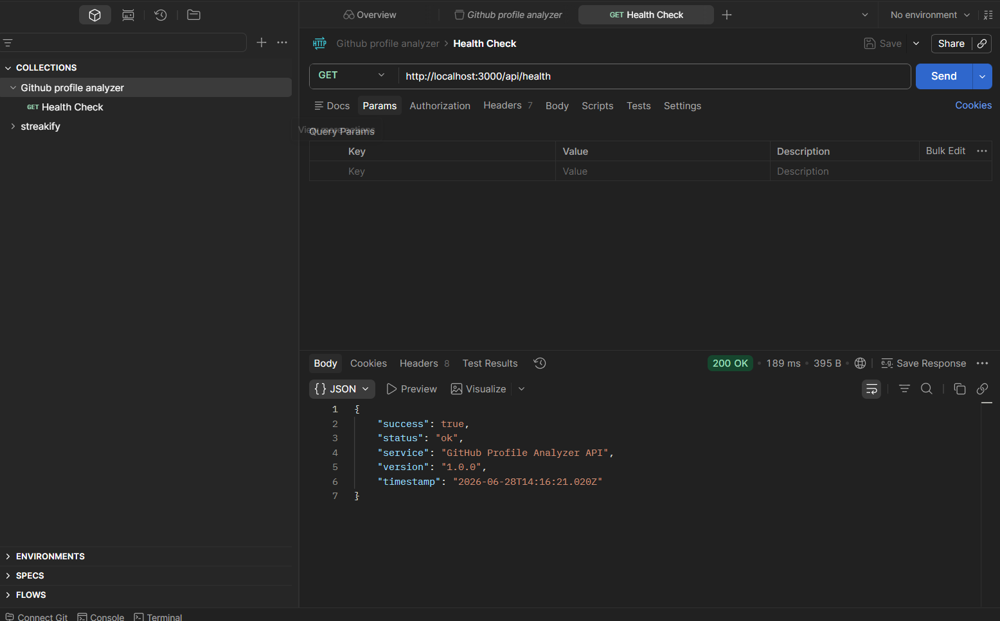

---

### Analyze User

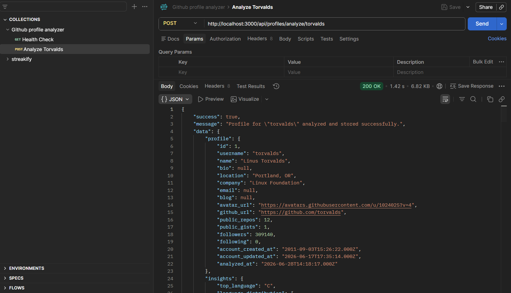

---

### List Profiles

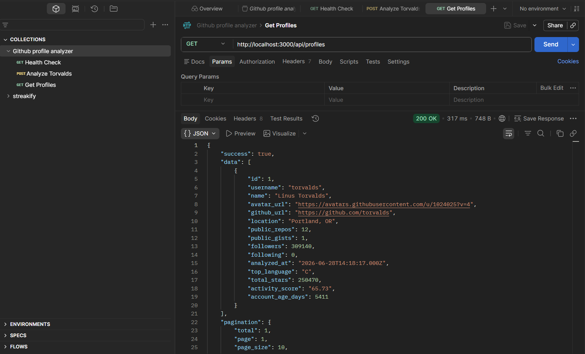

---

### Get Single Profile

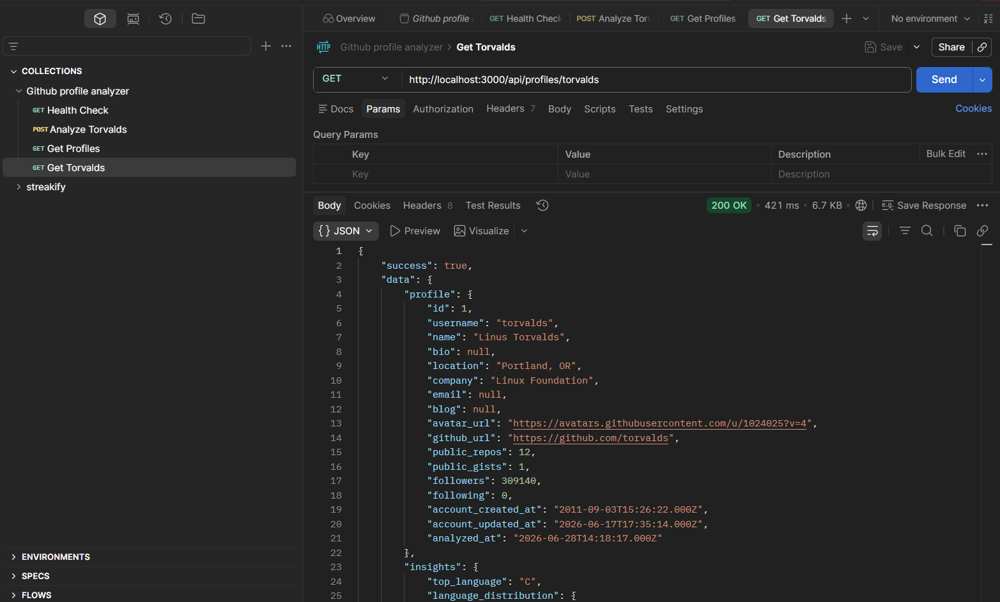

---

### Delete Endpoint

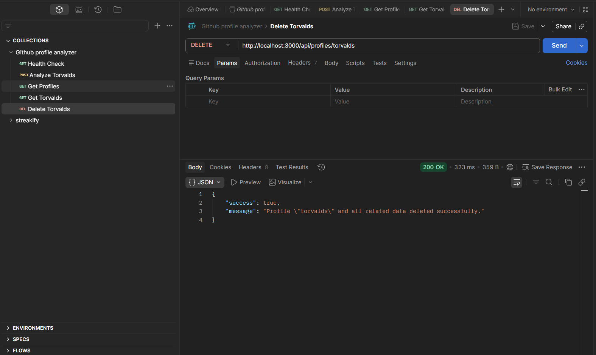

---

## 📁 Project Structure

```
github-profile-analyzer/
├── src/
│   ├── config/
│   │   ├── db.js              # MySQL connection pool
│   │   └── initDb.js          # DB schema runner
│   ├── controllers/
│   │   └── profileController.js
│   ├── routes/
│   │   └── profileRoutes.js
│   ├── services/
│   │   └── githubService.js   # GitHub API + insight computation
│   ├── middleware/
│   │   └── errorHandler.js
│   └── app.js
├── database/
│   └── schema.sql
├── postman/
│   └── GitHub_Profile_Analyzer.postman_collection.json
├── .env.example
├── .gitignore
├── package.json
├── server.js
└── README.md
```

### Repository Layout

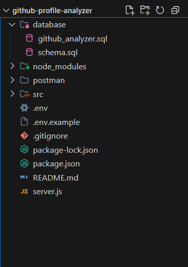

---

## 🚦 GitHub API Rate Limits

| Mode | Limit |
|---|---|
| Unauthenticated | 60 requests/hour |
| Authenticated (with token) | 5,000 requests/hour |

Add a `GITHUB_TOKEN` to your `.env` file to use authenticated mode. No special scopes are required for public data.

---

## 🌍 Deployment Notes

For production deployment (e.g., Railway, Render, Heroku):

1. Set all environment variables in your hosting platform's dashboard
2. Set `NODE_ENV=production`
3. Run `node src/config/initDb.js` once to initialize the remote DB
4. Start with `npm start`

---

## 📜 License

MIT
